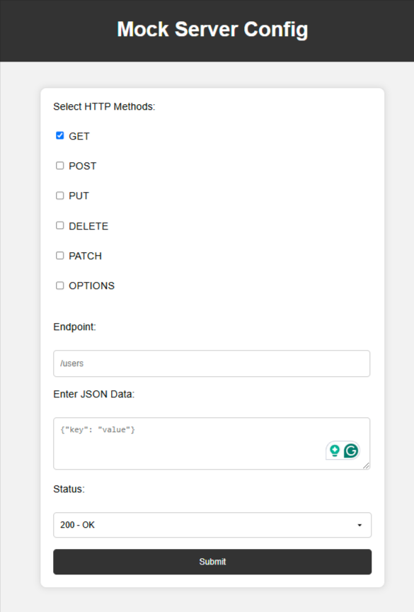

# Mock Server



## Description

Mock Server is a data mock server designed to facilitate UI and mobile development by providing a server to define endpoints and expected data. This allows developers to test and iterate on their applications without relying on actual backend services.

## Getting Started

Docker and Docker Compose installed on your machine-

### Installation

No installation is required, as the project uses Docker and Docker Compose. Simply clone the repository and navigate to the project directory.

### Running the Project

To run the Mock Server as a service:

```bash
docker run --name mock-server -p 8181:8000 -v your_config_file.yml:/app/config.yml webhkp/mock-server
```


### Runnin for Developement

For local development:

```bash
docker compose up
```

This will start the Mock Server in development mode.

### Setup configuration

Directly edit ```config.yml``` and add configuration like below, under ```route```-

```yaml
- endpoint: customer
  methods: ["GET"]
  response:
    _id: 67ab90746a3103a3b60a3229
    age: 32
    balance: $3,953.98
    eyeColor: brown
    gender: male
    guid: 320359a9-e3ad-45d7-bfbc-2f3966ac8805
    index: 0
    isActive: true
    name: Web Hkp
  status: 200
```

Or open ```http://localhost:8181``` and you will see a form. You can enter your configuration in the form.


## Features

* Define endpoints and expected data for mocking backend services
* Supports multiple endpoints and data formats
* Easy to use and configure

## Directory Layout

* `app/`: Source code for the Mock Server
* `docker-compose.yml`: Docker Compose configuration file
* `Dockerfile`: Dockerfile for building the Mock Server image
* `config.yml`: Configuration for api endpoint

## Contributing

Contributions are welcome! If you'd like to contribute to the project, please fork the repository and submit a pull request with your changes.

## License

This project is licensed under the [MIT License](https://opensource.org/licenses/MIT).

## Technology Stack

* Docker and Docker Compose for containerization and orchestration
* Python and FastAPI framework for building the Mock Server